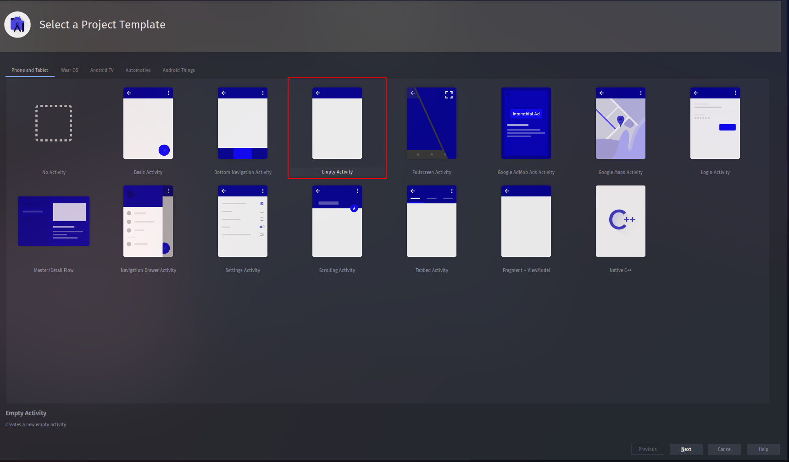
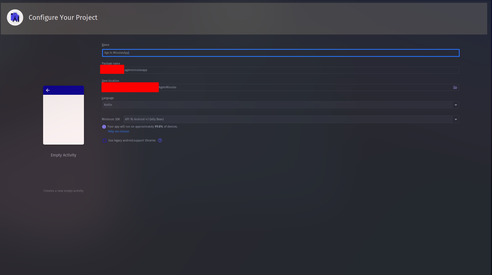

## [See Output](https://github.com/JoeJebitto/Android-Kotlin/blob/main/Age_In_Minutes/README.md)
# This Project Is Made Using 


# Step 1



# Step 2



# Build.gradle File

```groovy
plugins {
    id 'com.android.application'
    id 'kotlin-android'
    id 'kotlin-android-extensions'
}

android {
    compileSdkVersion 30
    buildToolsVersion "30.0.3"

    defaultConfig {
        applicationId "com.ageinminutesapp"
        minSdkVersion 16
        targetSdkVersion 30
        versionCode 1
        versionName "1.0"

        testInstrumentationRunner "androidx.test.runner.AndroidJUnitRunner"
    }

    buildTypes {
        release {
            minifyEnabled false
            proguardFiles getDefaultProguardFile('proguard-android-optimize.txt'), 'proguard-rules.pro'
        }
    }
    compileOptions {
        sourceCompatibility JavaVersion.VERSION_1_8
        targetCompatibility JavaVersion.VERSION_1_8
    }
    kotlinOptions {
        jvmTarget = '1.8'
    }
}

dependencies {

    implementation "org.jetbrains.kotlin:kotlin-stdlib:$kotlin_version"
    implementation 'androidx.core:core-ktx:1.5.0'
    implementation 'androidx.appcompat:appcompat:1.3.0'
    implementation 'com.google.android.material:material:1.3.0'
    implementation 'androidx.constraintlayout:constraintlayout:2.0.4'
    testImplementation 'junit:junit:4.+'
    androidTestImplementation 'androidx.test.ext:junit:1.1.2'
    androidTestImplementation 'androidx.test.espresso:espresso-core:3.3.0'
}
```

# Strings.xml [File](app/src/main/res/values/strings.xml)

```xml

<resources>
    <string name="app_name">AgeInMinutes</string>
    <string name="textCalculateYour">Calculate Your</string>
    <string name="age">Age</string>
    <string name="in_minutes">In Minutes</string>
    <string name="select_date">Selected Date</string>
    <string name="none">None</string>
    <string name="in_minutes_till_date">In Minutes Till Date</string>
    <string name="_0">0</string>
</resources>

```

# colors.xml [File](app/src/main/res/values/colors.xml)

```xml
<?xml version="1.0" encoding="utf-8"?>
<resources>
    <color name="purple_200">#FFBB86FC</color>
    <color name="purple_500">#FF6200EE</color>
    <color name="purple_700">#FF3700B3</color>
    <color name="teal_200">#FF03DAC5</color>
    <color name="teal_700">#FF018786</color>
    <color name="black">#FF000000</color>
    <color name="white">#FFFFFFFF</color>
    <color name="color1">#AE4FB8</color>
    <color name="color2">#844046</color>
    <color name="color3">#5EAFED</color>
</resources>
```

# activity_main.xml [File](app/src/main/res/layout/activity_main.xml)

```xml
<?xml version="1.0" encoding="utf-8"?>
<LinearLayout
        xmlns:android="http://schemas.android.com/apk/res/android"
        xmlns:tools="http://schemas.android.com/tools"
        xmlns:app="http://schemas.android.com/apk/res-auto"
        android:layout_width="match_parent"
        android:layout_height="match_parent"
        android:background="@color/color3"
        android:gravity="center_horizontal"
        android:orientation="vertical"
        android:padding="10dp"
        tools:context=".MainActivity">
    <TextView
            android:layout_width="wrap_content"
            android:layout_height="wrap_content"
            android:text="@string/textCalculateYour"
            android:textSize="25sp"
            android:textStyle="bold"
            android:layout_marginTop="15dp"
            android:textColor="@color/color2"/>

    <TextView
            android:layout_width="wrap_content"
            android:layout_height="wrap_content"
            android:text="@string/age"
            android:textSize="25sp"
            android:layout_margin="20sp"
            android:textStyle="bold"
            android:padding="10dp"
            android:background="#5E7080"
            android:layout_marginTop="1dp"
            android:textColor="@color/black"/>

    <TextView
            android:layout_width="wrap_content"
            android:layout_height="wrap_content"
            android:text="@string/in_minutes"
            android:textSize="25sp"
            android:textStyle="bold"
            android:layout_marginTop="1dp"
            android:textColor="@color/color2"/>

    <Button android:id="@+id/btnDatepicker"
            android:layout_width="match_parent"
            android:layout_height="wrap_content"
            android:text="@string/select_date"
            android:textSize="20sp"
            android:textColor="@color/black"
            app:backgroundTint="@color/color1"
            android:layout_marginTop="10sp"/>

    <TextView
            android:id="@+id/tvSelectedDate"
            android:layout_width="wrap_content"
            android:layout_height="wrap_content"
            android:text="@string/none"
            android:textSize="15sp"
            android:textStyle="bold"
            android:layout_marginTop="30dp"
            android:textColor="@color/color2"/>
    <TextView
            android:layout_width="wrap_content"
            android:layout_height="wrap_content"
            android:text="@string/select_date"
            android:textSize="15sp"
            android:textStyle="bold"
            android:layout_marginTop="10dp"
            android:textColor="#8A632797"/>

    <TextView
            android:id="@+id/tvSelectedDateInMinutes"
            android:layout_width="wrap_content"
            android:layout_height="wrap_content"
            android:text="@string/_0"
            android:textSize="90sp"
            android:textStyle="bold"
            android:layout_marginTop="50dp"
            android:textColor="@color/color2"/>
    <TextView
            android:layout_width="wrap_content"
            android:layout_height="wrap_content"
            android:text="@string/in_minutes_till_date"
            android:textSize="20sp"
            android:textStyle="bold"
            android:layout_marginTop="10dp"
            android:textColor="#8A632797"/>

</LinearLayout>
```

# MainActivity.kt [File](app/src/main/java/com/joeljebitto/ageinminutesapp/MainActivity.kt)

```kotlin
package com.joeljebitto.ageinminutesapp

import android.app.DatePickerDialog
import android.os.Bundle
import android.view.View
import android.widget.Button
import android.widget.TextView
import androidx.appcompat.app.AppCompatActivity
import com.joeljebitto.ageinminutesapp.R
import java.text.SimpleDateFormat
import java.util.*

class MainActivity : AppCompatActivity() {
    override fun onCreate(savedInstanceState: Bundle?) {
        super.onCreate(savedInstanceState)
        setContentView(R.layout.activity_main)
        findViewById<Button>(R.id.btnDatepicker).setOnClickListener { view ->
            clickDatePicker(view)
        }
    }

    private fun clickDatePicker(view: View) {
        val myCalendar = Calendar.getInstance()
        val year = myCalendar.get(Calendar.YEAR)
        val month = myCalendar.get(Calendar.MONTH)
        val day = myCalendar.get(Calendar.DAY_OF_MONTH)

        val dpd = DatePickerDialog(
            this,
            DatePickerDialog.OnDateSetListener { view, year_S, month_S, date_S ->

                val tvSelectedDate = findViewById<TextView>(R.id.tvSelectedDate)
                val tvSelectedDateInMinutes = findViewById<TextView>(R.id.tvSelectedDateInMinutes)
                val selectedDate = "$date_S/$month_S/$year_S"
                tvSelectedDate.text = selectedDate
                val sdf = SimpleDateFormat("dd/MM/yyyy", Locale.ENGLISH)
                val theDate = sdf.parse(selectedDate)
                val selectedDateInMinutes = theDate!!.time / 60000
                val currentDate = sdf.parse(sdf.format(System.currentTimeMillis()))
                val currentDateIoMinutes = currentDate!!.time / 60000
                val differenceInMinutes = currentDateIoMinutes - selectedDateInMinutes
                tvSelectedDateInMinutes.text = differenceInMinutes.toString()
            },
            year,
            month,
            day
        )

        dpd.datePicker.setMaxDate(Date().time)
        dpd.show()
    }

}
```

